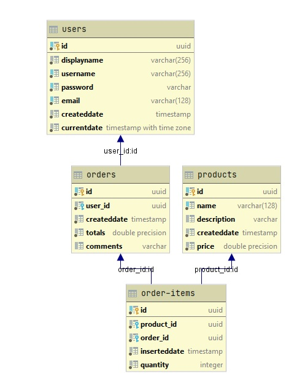

# **Back-end Developer Assignment**

## Azure deployed : https://ornico-coreapi.azurewebsites.net/swagger/index.html

## username:user
## password:user1234
## curl -X POST "https://ornico-coreapi.azurewebsites.net/api/Users/signin" -H  "accept: */*" -H  "Content-Type: application/json-patch+json" -d "{\"login\":\"user\",\"password\":\"user1234\"}"

# PostgreSQL 
ER Diagram

# Questions 1
If you had more time, what further improvements or new features would you add?
# Amswer 1
If I had more time I would suggest doing 2 things. The first would be to slightly enrich the DB shema having 2 more extra tables, one for shipments and the other for suppliers so that I could create more complex queries in the database for extracting complex information. The second I would suggest to include a Microservices architecture, however it would be somehow over... as far as an assigment is concerned.

# Questions 2
Which parts are you most proud of? And why?
# Amswer 2
I am proud of the design as well as the way the different components have been implemented, such as the model, repository, service and api. The src code is written in such a way that it is readable and easy to extent, since I had in my mind during the design process the Open Close principle.

# Questions 3
Which parts did you spend the most time with? What did you find most difficult?
# Amswer 3
In the beginning the process of fragmenting the application into different components was a bit time consuming. However, once this was completed, then the whole implementation process accelerated a lot. I did not find anything difficult, all the requirements were pretty straightforward for me.

# Questions 4
How did you find the test overall? Did you have any issues or have difficulties completing?
# Amswer 4
It was nice. Thank you. No I have not any difficulties completing this. :)
